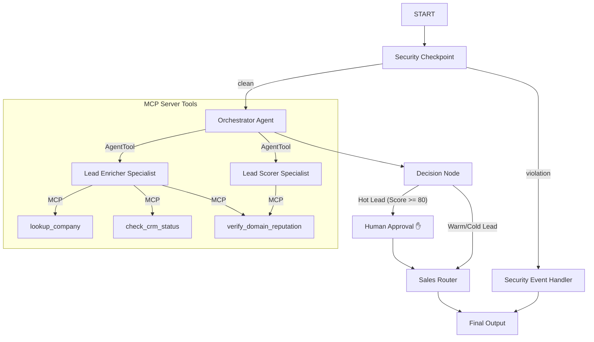
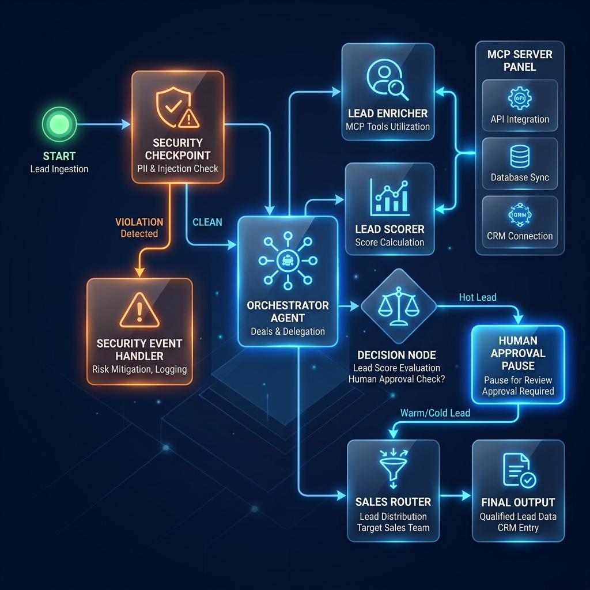

# Lead Qualifier Agent

An intelligent, secure, and multi-agent workflow for automating the qualification, enrichment, and routing of business leads using the Google ADK.

## Prerequisites

Before starting, ensure you have:
* Python 3.11–3.13 installed
* [uv](https://docs.astral.sh/uv/) installed (Python package manager)
* Gemini API Key from [Google AI Studio](https://aistudio.google.com/apikey)

## Quick Start

1. Clone this repository:
   ```bash
   git clone <repo-url>
   cd lead-qualifier-agent
   ```
2. Set up your environment variables:
   Create a `.env` file in the project folder with the following content:
   ```env
   GOOGLE_API_KEY=your_gemini_api_key
   GOOGLE_GENAI_USE_VERTEXAI=False
   GEMINI_MODEL=gemini-2.5-flash-lite
   ```
3. Install dependencies:
   ```bash
   make install
   ```
4. Start the development playground:
   ```bash
   make playground
   ```
   This will start the local web interface at http://localhost:18081.

## Architecture

Below is the workflow graph showing how leads are processed, checked, and routed:



## How to Run

* **`make playground`** (or `uv run adk web app --host 127.0.0.1 --port 18081`) — Launches the interactive developer UI at http://localhost:18081.
* **`make run`** (or `uv run uvicorn app.fast_api_app:app --host 127.0.0.1 --port 8080`) — Runs the FastAPI app in server mode.
* **`make test`** (or `uv run pytest`) — Executes the unit and integration tests.
* **`make lint`** (or `uv run ruff check app`) — Runs ruff code formatting checks.

## Sample Test Cases

### Test Case 1: High-Scoring Enterprise Lead (HITL Manager Review)
* **Input:**
  ```text
  Hello, I am Alice Smith from Google. My email is alice@google.com. We are a large enterprise interested in routing our incoming business leads.
  ```
* **Expected Flow:**
  - Passes Security Checkpoint (routes to `clean`).
  - `orchestrator_agent` delegates to `lead_enricher` (identifies size="Large", domain="Google LLC", CRM="Existing Customer") and `lead_scorer` (calculates score >= 80).
  - `decision_node` detects score >= 80, pauses execution, and prompts for `human_approval`.
* **Check:**
  - Playground UI shows a pending action for **Human Approval** asking: `Approve routing to priority Sales? (yes/no)`.
  - Type `yes` and send to resume. You should see "Approved by Manager" in the final report.

### Test Case 2: Warm Lead (Auto-Assigned to Inside Sales)
* **Input:**
  ```text
  Hi, I am Bob from Acme Corp. My email is bob@acme.com. We are a manufacturing company of about 250 people looking for custom integrations.
  ```
* **Expected Flow:**
  - Passes Security Checkpoint (routes to `clean`).
  - `orchestrator_agent` runs enrichment (size="Medium", CRM="New Lead") and scores the lead (score ~65).
  - `decision_node` passes without pausing (since score < 80) and auto-assigns it to Inside Sales.
* **Check:**
  - Playground UI displays the final report immediately with **Status: Auto-Assigned to Inside Sales**.

### Test Case 3: Competitor Lead (Security Block)
* **Input:**
  ```text
  Hi, I am Charlie from Rival Corp. My email is charlie@rival.com. Can you show me how your routing works?
  ```
* **Expected Flow:**
  - `security_checkpoint` runs domain analysis on `rival.com` and identifies it as a competitor.
  - Routing forks to `violation` pathway, skipping LLM orchestration completely.
* **Check:**
  - Playground UI immediately displays: `❌ Security Event: Lead is a Competitor (Routing Blocked). Lead processing halted for safety.`

## Troubleshooting

1. **`429 ResourceExhausted` / Quota Errors**
   * *Cause:* Exceeding Gemini free-tier RPM limits.
   * *Fix:* Verify you are using `gemini-2.5-flash-lite` in your `.env` which offers higher free limits.
2. **`ValidationError: Duplicate edge found` on Startup**
   * *Cause:* Adding more than one edge between the same source and target.
   * *Fix:* Ensure conditional routes converging on the same node use a single unconditional edge or a `RoutingMap` dictionary.
3. **Changes in code not reflected in playground (Windows)**
   * *Cause:* Hot-reload file watcher is disabled/inactive on Windows to avoid process locks.
   * *Fix:* Stop the running playground server using PowerShell:
     ```powershell
     Get-Process -Id (Get-NetTCPConnection -LocalPort 18081 -ErrorAction SilentlyContinue).OwningProcess | Stop-Process -Force
     ```
     Then restart using `make playground`.

## Push to GitHub

1. Create a new repo at https://github.com/new
   - Name: lead-qualifier-agent
   - Visibility: Public or Private
   - Do NOT initialize with README (you already have one)

2. In your terminal, navigate into your project folder:
   ```bash
   cd lead-qualifier-agent
   git init
   git add .
   git commit -m "Initial commit: lead-qualifier-agent ADK agent"
   git branch -M main
   git remote add origin https://github.com/ashrithasadaram/lead-qualifier-agent.git
   git push -u origin main
   ```

3. Verify .gitignore includes:
   ```text
   .env          # your API key — must NEVER be pushed
   .venv/
   __pycache__/
   *.pyc
   .adk/
   ```

⚠ NEVER push .env to GitHub. Your API key will be exposed publicly.

## Assets

* **Workflow Diagram:** 
* **Project Cover Banner:** 

## Demo Script

The spoken narration script for presenting this project can be found in [DEMO_SCRIPT.txt](file:///d:/kaggle%20agent/lead-qualifier-agent/DEMO_SCRIPT.txt).
