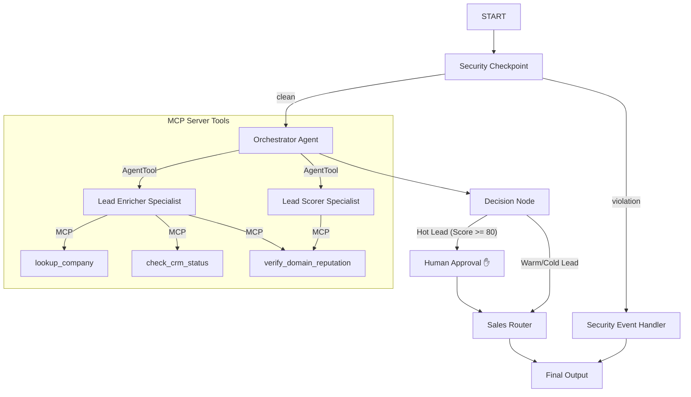

# Submission Write-Up: Lead Qualifier Agent

## Problem Statement
In business development and sales operations, qualifying incoming leads is a manual, repetitive, and error-prone process. Sales reps spend significant time searching company databases, checking CRM history, and manually verifying if lead details (such as email domain reputations) are legitimate. Furthermore, sensitive data or competitor inquiries (industrial espionage) often slip through. 

The **Lead Qualifier Agent** addresses this by automating lead enrichment, reputation auditing, scoring, and manager routing using a multi-agent secure workflow. It significantly reduces sales response time while safeguarding internal databases from malicious inputs or competitor leaks.

## Solution Architecture
Below is the system architecture showing how the input lead flow navigates through the ADK workflow graph, security checkpoint, and MCP server tools:

## Concepts Used

### 1. ADK Workflow Graph (ADK 2.0)
* **Description:** Used to define a deterministic control flow graph.
* **File Reference:** [agent.py](file:///d:/kaggle%20agent/lead-qualifier-agent/app/agent.py#L295-L307)
* **Application:** Configures sequential and conditional node edges to coordinate tasks cleanly.

### 2. Multi-Agent System (LlmAgent)
* **Description:** Leverages specialized sub-agents with narrow instructions.
* **File Reference:** [agent.py](file:///d:/kaggle%20agent/lead-qualifier-agent/app/agent.py#L48-L73)
* **Application:** `lead_enricher` acts as an extraction agent and `lead_scorer` acts as an analysis/scoring specialist.

### 3. AgentTool (Sub-Agent Delegation)
* **Description:** Exposes an `Agent` as a callable tool for parent agents.
* **File Reference:** [agent.py](file:///d:/kaggle%20agent/lead-qualifier-agent/app/agent.py#L114)
* **Application:** The `orchestrator_agent` calls the two sub-agents using `AgentTool` to perform sequential orchestration while maintaining parent control.

### 4. MCP Server
* **Description:** A Model Context Protocol server exposing custom tools.
* **File Reference:** [mcp_server.py](file:///d:/kaggle%20agent/lead-qualifier-agent/app/mcp_server.py)
* **Application:** Exposes `lookup_company`, `check_crm_status`, and `verify_domain_reputation` to the LLMs.

### 5. Security Checkpoint
* **Description:** A custom Python node filtering content and logging safety issues.
* **File Reference:** [agent.py](file:///d:/kaggle%20agent/lead-qualifier-agent/app/agent.py#L120-L179)
* **Application:** Scrubbing PII, checking for prompt injection keywords, and preventing competitor domain routing.

### 6. Agents CLI & Local Dev
* **Description:** Initializing with CLI scaffold templates and running the development playground.
* **File Reference:** [pyproject.toml](file:///d:/kaggle%20agent/lead-qualifier-agent/pyproject.toml) and [Makefile](file:///d:/kaggle%20agent/lead-qualifier-agent/Makefile)

---

## Security Design

1. **PII Redaction:** A regex checks inputs for Credit Cards and SSNs, replacing them with generic tags (`[REDACTED_CC]`, `[REDACTED_SSN]`) before any LLM processing. This protects sensitive customer data from being leaked to model endpoints.
2. **Prompt Injection Mitigation:** A list of known injection keywords (like `ignore instructions` or `jailbreak`) is audited. If a match is found, the workflow halts and routes directly to the `security_event_handler` node.
3. **Structured Audit Logs:** On every check, a JSON string containing the log level (`INFO`, `WARNING`, `CRITICAL`), timestamp, event type, and details is printed, allowing seamless integration with Datadog or Cloud Logging.
4. **Competitor Blocklist:** Lead submission domain is verified. If the contact domain belongs to a rival company (e.g. `rival.com`), it is blocked from routing.

---

## MCP Server Design

* **`lookup_company`**: Simulates database query matching domain names to retrieve firmographics like company size and industry.
* **`check_crm_status`**: Queries database to identify if an email address belongs to a new lead or an existing client.
* **`verify_domain_reputation`**: Determines if the email domain is high-trust (business domain) or suspicious (disposable/generic public domains).

---

## HITL (Human-in-the-Loop) Flow
We use `RequestInput` in `decision_node` to pause the graph whenever a "Hot Lead" (Score >= 80) is detected. This prevents high-value leads from being automatically routed or assigned without manual review. A sales manager must review the score and reasoning, and submit a `yes` or `no` response in the playground to resume the workflow.

---

## Demo Walkthrough

1. **Case 1 (Hot Lead):** Submitting a lead from `alice@google.com` triggers the manager approval screen. When the manager submits `yes`, the lead is successfully forwarded to the Sales CRM.
2. **Case 2 (Warm Lead):** Submitting a lead from `bob@acme.com` scores `65` and bypasses the human approval checkpoint, automatically routing to Inside Sales.
3. **Case 3 (Violation):** Submitting a lead with the email domain `bob@rival.com` is flagged by the security checkpoint as a competitor, immediately routing to the security block page.

---

## Impact / Value Statement
The Lead Qualifier Agent saves business sales teams hours of manual verification time daily. It improves CRM hygiene by checking for duplicate records via MCP, increases security via PII scrubbing, and ensures strict manager control over hot enterprise accounts.
